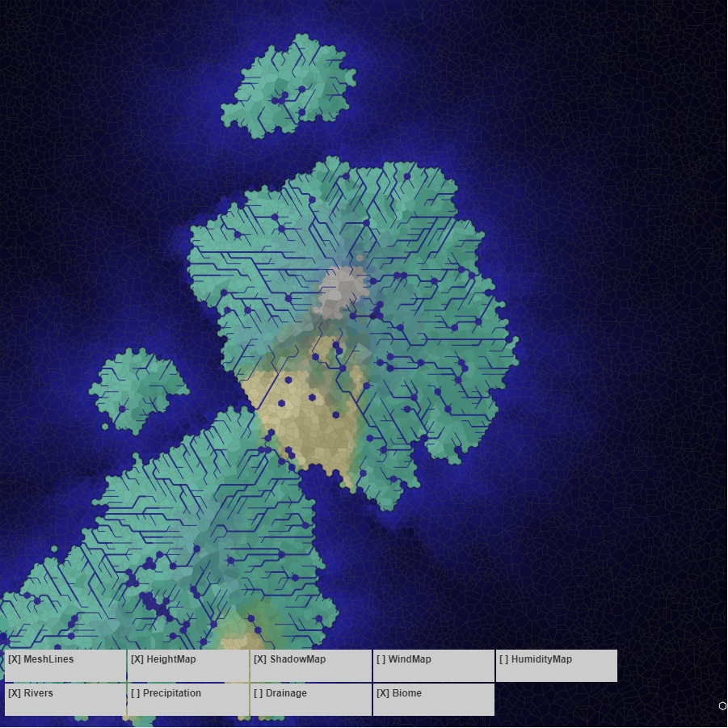
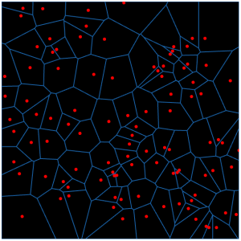

# Terrain Procedural General Experiments

This is a repository of experimental projects to procedurally generate terrain.

## /Terrain

This is the most involved one, featuring voronoi and hexagonal heightmaps, wind and
precipitation, river flux generation, and biomes based on the Holdridge model.

[More detail in /terrain](/terrain/readme.md)

## /Water

A sprite-based erosion mechanism based heavily on a C++ example series and modified heavily. Not fast enough
(and may still have bugs).

## /voronoi-example

An initial project working with Voronoi grids and trying to build a definition file for TypeScript.

Uses the [Javascript-Voronoi](https://github.com/gorhill/Javascript-Voronoi) library and Phaser 3 polygons:
* A handwritten Typescript definition file, the hardest part: [see it here](./voronoi-example/src/typings/voronoi.d.ts)
* Turns out it's super important to `setOrigin(0,0)` when you're drawing polygons

# Running the Project

This project has a number of things built-in:
* eslint: a mix of recommended and reasonable rules, autofix is on by default in vscode via settings
* typescript: 3.8.3+
* editorconfig because vscode will autofix to standard stuff if you have the extension
* wallaby (Ctrl+R, R) for realtime test runner
* jest for tests
* phaser as the base engine

## Top Level Commands
There are only two top-level commands at the moment:
* `npm test` - (only `/terrain` tests are active right now for wallaby)
* `npm run lint`

## Example Projects

The commands are the same in each project folder:

1. `cd voronoi-example`
2. `npm install`
3. `npm run start`
