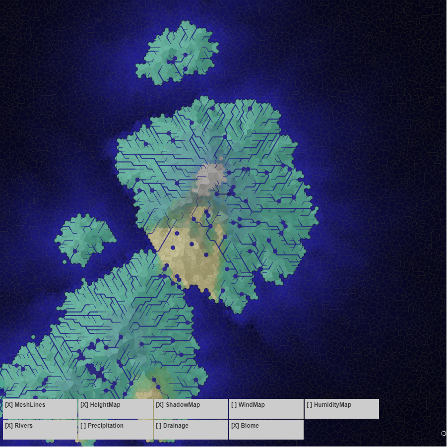

# Procedural Terrain Example

This uses a combination of Voronoi and Hexagonal meshes to generate procedural terrain.

Contents:

* [Overview](#Overview)
* [Examples](#Examples)
* [Reading the code](#Reading-the-code)

# Overview

Simulation steps:

* Creates a Voronoi mesh
* Generates a starting heightmap using Open Simplex 2D noise
* Adds peaks (input) to map and adjusts heightmap based on falloff rate
* Creates a hexagonal mesh from Voronoi mesh
* Pre-calculates slopes to all neighboring mesh tiles
* Identities Ocean tiles vs Land
* Propagates wind from starting edge values (input) across map
* Calculates humidity + precipitation based on wind map, ocean tiles
* Calculates drainage and rivers from precipitation and heightmap
* Recalculates slopes to account for lakes
* Recalculates humidity/precipitation to account for lakes
* Recalculates river to account for precipitation changes
* Calculates biomes from temperation (input + heightmap) and precipitation
* Calculates a shadow + highlight map from heightmap + rivers/lakes

This currently takes about 15 seconds on my local machine, with the wind proporagation being one of the heavier steps.

# Examples

4 peaks, 6mps Eastern trade winds, average coastal temp of 18 ℃, plus some built in settings (4km max height, 1 pixel = 2km ratio, fixed evaporation + transpiration rates)

**Heightmap**

Lighter is higher, blue is ocean.

**Wind**

Arrows indicate direction. Force is indicated by size, color, and alpha of the arrow.

General Mechanics:

* Wind travels in the prevailing direction
* It slows and turns aside when it runs into upward sloping land
* It expands into lower pressure neighboring cells
* It speeds up as it goes down hill
* Some turbulence effects in cases wheer lots of inputs with different directions

**Shadow + Highlights**

Added some shadow and highlighting to try and make the height more visible.

**Humidity Propagation**

* Ocean and lake cells evaporate
* Rivers evaporate a little less
* The wind carries humidity
* Some is lost as precipitation (but assumes an even amount gains as transpiration/evaporation)
* A lot is lost going uphill (drives precipitation)

_Note: this is the final map, after lakes and rivers were calculated (not currently visible)_

**Drainage**

* Precipitation from humidity map drives inputs for drainage
* Water flows to lowest neighboring cell as a river
* Water floods into lakes when it has nowhere to go, until it finds an outlet to create a new river or merges with a larger lake

**Rivers and Lakes**

* Lakes have amount/height from the pooling function of drainage
* "Rivers" are any drainage path that carries more than a certain amount of water

_There's a lot more to do here, but I need to upsample the tiles first_

**Biome Precipitation Rates (land only rates)**

**Biome Classifications**

* Based on the [Holdridge Life Zones model](https://en.wikipedia.org/wiki/Holdridge_life_zones#/media/File:Lifezones_Pengo.svg), using Precipitation and Temperature
* Added some extra biomes where numbers didn't quite work
* Temperature is a calculation of coastal temperature + height (no isual map available)

**Example #2**

Starting with a different set of assumptions generates a different map.

7 peaks (mostly low), 6mps SSW trade winds, average coastal temp of 18 ℃, and a new seed for the randomizer:

# Reading the Code

This is exploratory code, so it's not really super-discoverable and there's a number of deadends, cruft, and odd commented out sections. I'm also using Phaser, which has it's own lifecycle events that I can count on being called (but likely won't be obvious if you haven't worked with it before).

## HybridScene

The [game.ts](./src/game.ts) file runs the first scene I have defined, [HybridScene.ts](./src/Scenes/HybridScene.ts).

_Note: Ignore VoronoiDrivenScene and HexagonDrivenScene, these are early code that likely no longer work_

[HybridScene.ts](./src/Scenes/HybridScene.ts) currently has a lot of hard-coded parameters in the top that control the generation:

### Parameters

_[HybridScene.ts](./src/Scenes/HybridScene.ts#L21)_

Things I rarely change:
* `WIDTH` + `HEIGHT`: Size of the map in pixels
* `SITECOUNT`: number of sites for the voronoi diagram
* `INITIAL_HEIGHT_SCALE_M`: Used in height noise and inversely for ocean
* `MAX_HEIGHT_SCALE_M`: Tallest possible point on the map (used for peaks)
* `HEXAGON_WIDTH`, `HEXAGON_HEIGHT`: size of hexagon tiles
* `WATER_TO_HEIGHT_RATIO`: 1 "unit" of water equals this many meters in height (pools)

Other things I rarely change that are related:
* `HEIGHT_GEN_FALLOFF`: General falloff rate/slop for mountain peaks
* `PX_TO_KM`: Number of pixels/km - used for slopes (wind, rain, temp, etc)
* `EVAPORATION_RATE`: Totally made up number, percent added to humidity each run (another made up number)
* `TRANSPIRATION_RATE`: Also made up number, percent added to humidity each run
* `PRECIPITATION_RATE`: One more made up number
* `PRECIPITATION_SLOPE_MULTIPLIER`: multiplier for amount of rain when going uphill

For new maps:
* `SEED`: the seed for randomization (noise and peak locations)
* `PEAKS`: list of peak heights - used to place peaks randomly on map
* `INITIAL_WIND_SPEED`: 6 m/s, average trade wind
* `INITIAL_WIND_DIR`: degrees, currently there's a bug so only 0, 60, 120, 180, 240, 300 are working
* `TEMP_AT_SEALEVEL`: temperature at sealevel in degrees celsius

### Simulation

_Defined at [HybridScene.ts](./src/Scenes/HybridScene.ts#L154)_

Phaser calls `create` and `create` on the scene automatically, and then repeats the `update` call.

The simulation is defined as a state machine, with some steps queued to run once and some queued to run until a condition is true. The `update` call tells the simulation to ru a step, and whe nthat step is compleet a callback is called, `updateAvailableLayersFromSimulation`.

The `updateAvailableLayersFromSimulation` method sets variables to indicate that a layer is now available and/or whether it should be force-redrawn (if currently visible). Layer visibility is toggled from buttons on the screen and, if a layer is visible, will "redraw" on or more display groups that correspond to that layer. I did this to make it easy to turn map layers on and off without re-running the whole loop.

Simulation steps:

* **initializeState**: [HybridScene.ts](./src/Scenes/HybridScene.ts), creates voronoi mesh
* **basic noise**: [BasicNoise.ts](./src/generator/heightmap/BasicNoise.ts), generates heightmap from noise
* **mountain island**: [BasicNoise.ts](./src/generator/heightmap/MountainIsland.ts), adds mountain peaks
* **create hexagonal mesh**: [HybridScene.ts](./src/Scenes/HybridScene.ts), creates heagonal mesh from voronoi
* _**height erosion**: [ErosionSimulation.ts](./src/generator/heightmap/ErosionSimulation.ts), erodes map - disabled: slow and doesn't add value anymore_
* **recalculate slopes**: [HybridScene.ts](./src/Scenes/HybridScene.ts), pre-calculates slopes for all Hexagon tiles to neighbors (performance)
* **ocean + weather init**: [HybridScene.ts](./src/Scenes/HybridScene.ts), categorize tiles as Land/Ocean, initialize some weather values
* **winds**: [WindGenerator.ts](./src/generator/weather/wind/WindGenerator.ts), a lot of logic to propagate wind across map
* **humidity**: [HumidityGenerator.ts](./src/generator/weather/humidity/HumidityGenerator.ts), uses wind to propagate humidity
* **rain, rivers, flooding**: [RiverMapper.ts](./src/generator/river/RiverMapper.ts), uses humidity to calculate rain, drainage, and flooding/pooling
* **biomes**: [BiomeAssigner.ts](./src/generator/biome/BiomeAssigner.ts), calcs temperature and annual rainfall to map to a biome
